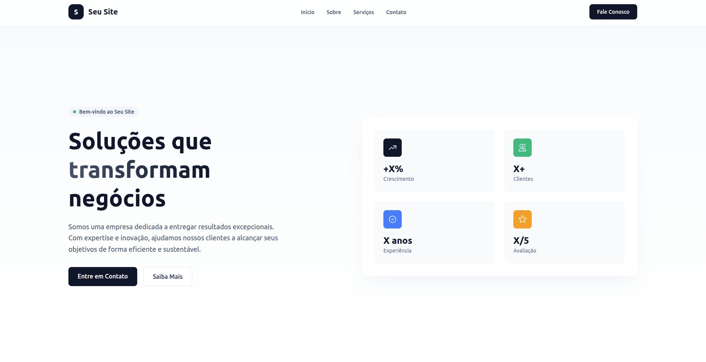

# Whitelabel Website – Development Showcase

Este é um site **whitelabel** desenvolvido para demonstrar serviços de **desenvolvimento web**, podendo ser facilmente adaptado, personalizado e reutilizado como base para diferentes marcas, clientes ou projetos.

O objetivo do projeto é servir como um **site institucional flexível**, apresentando soluções digitais, portfólio e informações de contato de forma moderna e profissional.



🔗 **Preview:** [https://seu-site-beta.vercel.app/#inicio](https://seu-site-beta.vercel.app/#inicio)

---

## 🚀 Sobre o Projeto

O site foi desenvolvido utilizando **Next.js**, com foco em:

* Performance
* SEO
* Escalabilidade
* Facilidade de customização (whitelabel)

Ele pode ser usado como:

* Site institucional
* Landing page de serviços
* Portfólio de desenvolvimento
* Base para múltiplos clientes (mudando apenas textos, cores e branding)

---

## 🧩 Características Principais

* ✅ Estrutura **whitelabel**, pronta para personalização
* ✅ Layout moderno e responsivo
* ✅ Navegação por seções (one-page)
* ✅ Código limpo e organizado
* ✅ Otimizado para SEO
* ✅ Deploy simplificado com Vercel

---

## 🛠️ Tecnologias Utilizadas

* **Next.js** – Framework React para aplicações web
* **TypeScript** – Tipagem estática
* **React** – Biblioteca de UI
* **Next Font (Geist)** – Fonte otimizada automaticamente
* **CSS Modules / Tailwind (se aplicável)** – Estilização
* **Vercel** – Deploy e hospedagem

---

## ▶️ Como Rodar o Projeto Localmente

### 1. Instalar dependências

```bash
npm install
# ou
yarn install
# ou
pnpm install
# ou
bun install
```

### 2. Iniciar servidor de desenvolvimento

```bash
npm run dev
# ou
yarn dev
# ou
pnpm dev
# ou
bun dev
```

### 3. Acessar no navegador

```
http://localhost:3000
```

---

## 🧱 Estrutura Base

```bash
app/
 ├── page.tsx        # Página principal
 ├── layout.tsx      # Layout global
 └── globals.css     # Estilos globais
public/
 └── assets/         # Imagens e arquivos estáticos
```

---

## 🎨 Customização Whitelabel

Para adaptar o site para outro cliente ou marca:

* Alterar textos e seções em `app/page.tsx`
* Ajustar cores e identidade visual nos estilos
* Substituir logo e imagens em `/public`
* Atualizar domínio e metadados de SEO

---

## 🌐 Deploy

O deploy é feito facilmente com a **Vercel**:

1. Conecte o repositório no Vercel
2. Configure o projeto como Next.js
3. Deploy automático a cada push

📚 Documentação oficial:
[https://nextjs.org/docs/deployment](https://nextjs.org/docs/deployment)

---

## 📄 Licença

Projeto de uso **whitelabel**.
Pode ser reutilizado e adaptado conforme necessidade.

---

## 👨‍💻 Autor

Desenvolvido como base para projetos de **desenvolvimento web profissional**, focado em performance, design e reutilização.

---

**Status:** Em desenvolvimento
**Versão:** Beta
**Última atualização:** 2026
